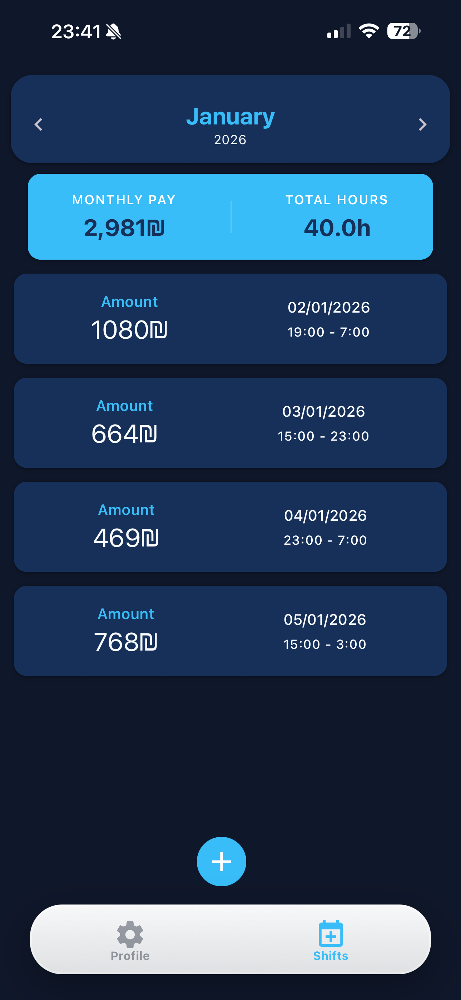
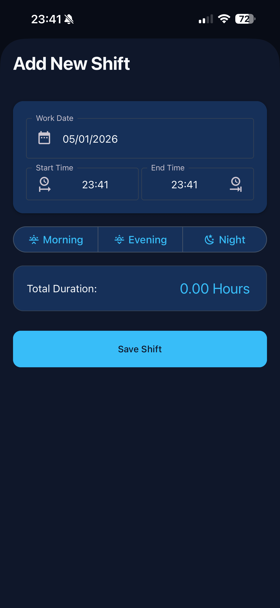
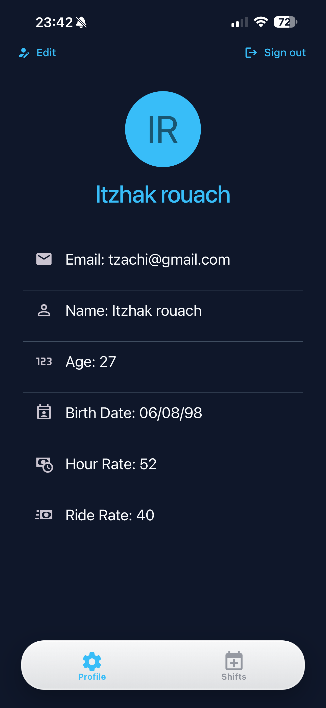

# 🛡️ GuardPay: Smart Shift & Salary Tracker

**GuardPay** is a premium mobile utility designed for security personnel and shift-based workers to effortlessly track work hours, calculate real-time earnings, and manage professional profiles with a modern, glass-morphic interface.

## ✨ Key Features

- **📊 Monthly Analytics Dashboard**: Get a bird's-eye view of your financial health with real-time tracking of "Monthly Pay" and "Total Hours" worked.
- **📅 Precision Shift Logging**:
  - One-tap shift entry with "Morning", "Evening", and "Night" presets.
  - Automated duration calculation based on start and end times.
  - Historical shift overview with detailed pay breakdowns per session.
- **👤 Dynamic Profile Management**:
  - Set custom base hourly rates and travel/ride compensation.
  - Automatic age calculation from birthdate.
  - Seamless integration with Appwrite for secure data persistence.
- **🎨 Premium Liquid-Glass UI**:
  - Immersive Dark Mode experience.
  - Translucent "Glass" tab bar and elevated surface cards.
  - High-contrast typography for readability in low-light environments.

---

## 🚀 Tech Stack

- **Framework**: [React Native](https://reactnative.dev/) with [Expo](https://expo.dev/)
- **Navigation**: [Expo Router](https://docs.expo.dev/router/introduction/) (File-based routing)
- **Backend**: [Appwrite](https://appwrite.io/) (Authentication & NoSQL Database)
- **UI Components**: [React Native Paper](https://reactnativepaper.com/)
- **Styling**: Custom Glassmorphism using `expo-blur` and `expo-linear-gradient`

---

The cleanest and most reliable way to display images on GitHub is using Relative Paths. This method is preferred because it works automatically across different branches and even if you rename your repository, as it doesn't rely on a hardcoded URL.

🖼️ The Cleanest Gallery Snippet
Replace your gallery section with this code. It uses HTML for better control over alignment and sizing:

Markdown

## 📸 Screen Gallery

<p align="center">
  
  
  
</p>

<p align="center">
  <em>Monthly Dashboard &bull; Shift Entry &bull; User Profile</em>
</p>

## 🛠️ Installation & Setup

1.  **Clone the repository**:

    ```bash
    git clone [https://github.com/ItzhakRouach/guardPay.git](https://github.com/ItzhakRouach/guardPay.git)
    cd guardPay
    ```

2.  **Install dependencies**:

    ```bash
    npm install
    ```

3.  **Environment Variables**:
    Create a `.env` file in the root directory and add your Appwrite credentials:

    ```env
    EXPO_PUBLIC_APPWRITE_ENDPOINT=[https://cloud.appwrite.io/v1](https://cloud.appwrite.io/v1)
    EXPO_PUBLIC_APPWRITE_PROJECT_ID=your_project_id
    EXPO_PUBLIC_APPWRITE_DB=your_database_id
    EXPO_PUBLIC_APPWRITE_USERS_PREFS_ID=your_collection_id
    ```

4.  **Launch the app**:
    ```bash
    npx expo start
    ```

---

## 🛣️ Roadmap

- [ ] **Push Notifications**: Reminders to clock out of shifts.
- [ ] **Export to PDF**: Generate professional monthly work reports for employers.
- [ ] **Bonus Tracking**: Add holiday pay rates and overtime multipliers.

---

## 🤝 Contributing

Contributions, issues, and feature requests are welcome! Feel free to check the [issues page](https://github.com/ItzhakRouach/guardPay/issues).

---

## 📜 License

Distributed under the MIT License. See `LICENSE` for more information.

**Created by [Itzhak Rouach](https://github.com/ItzhakRouach)**
