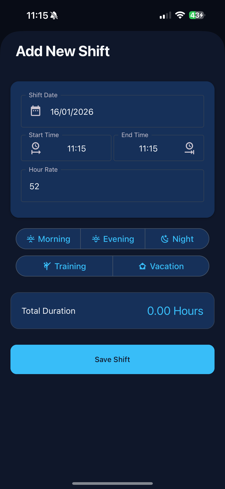
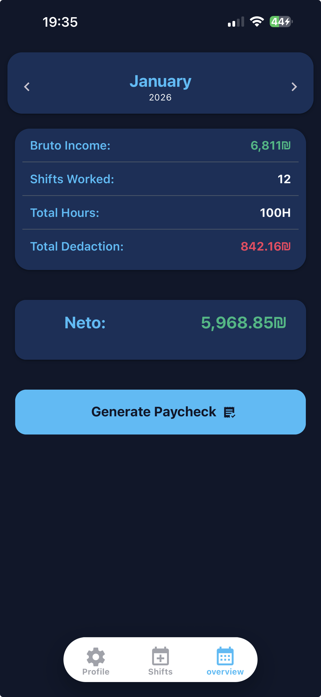
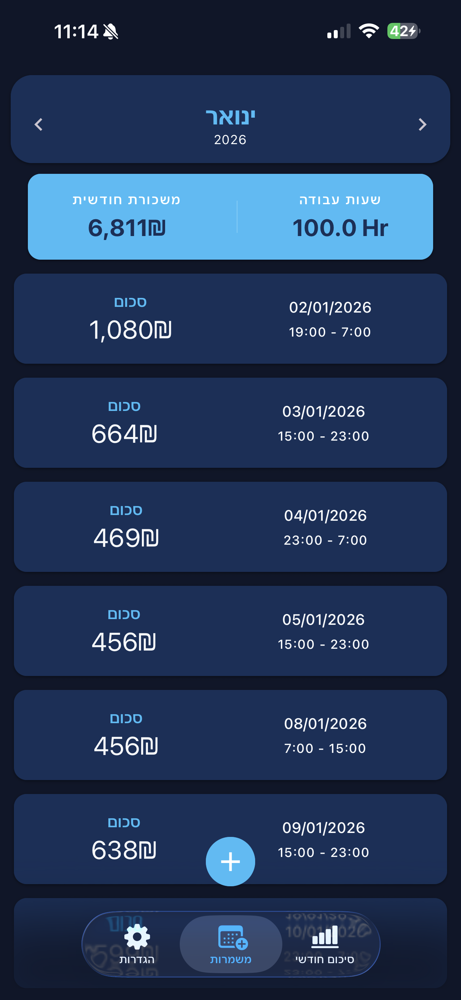
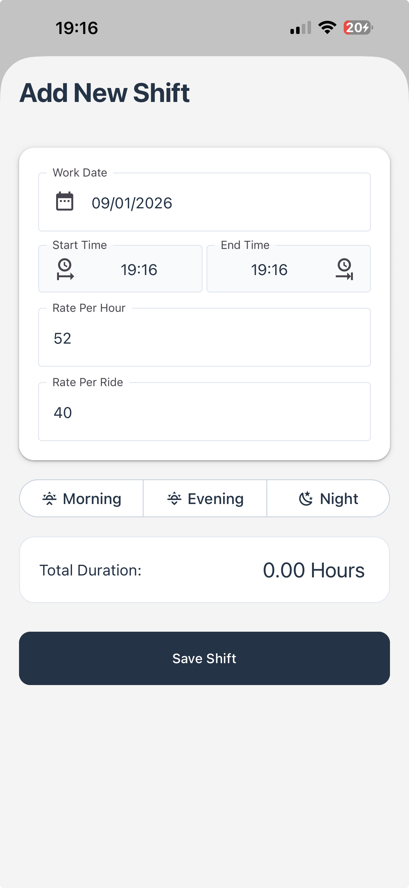
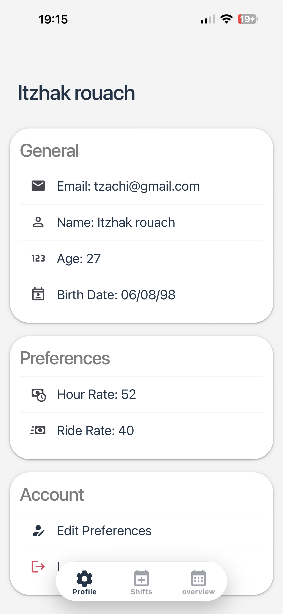
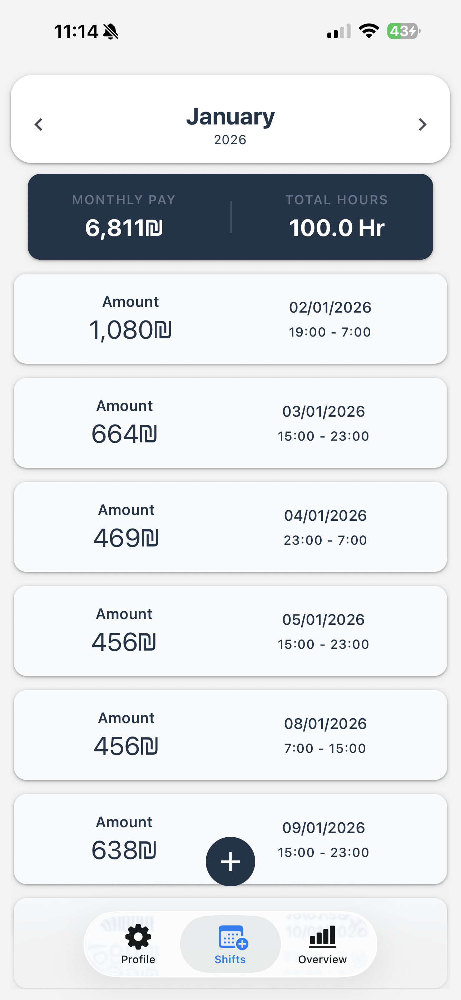
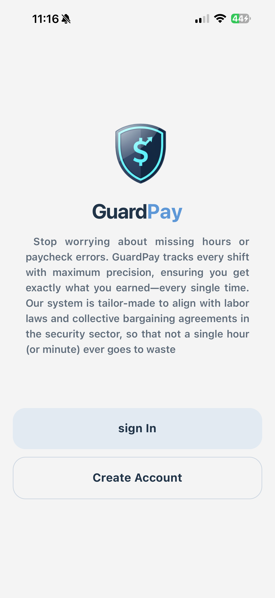
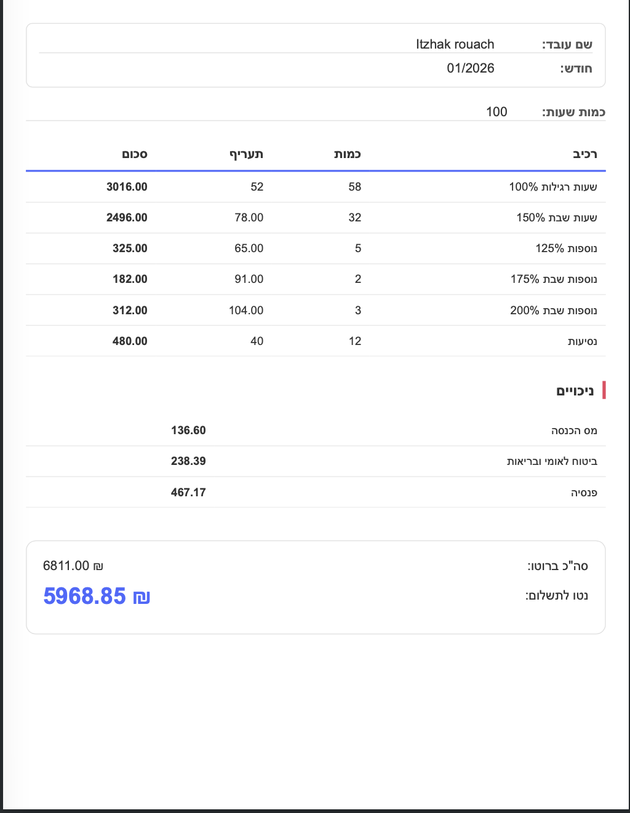
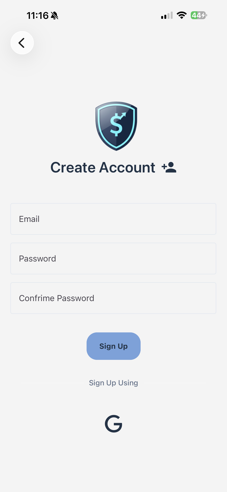
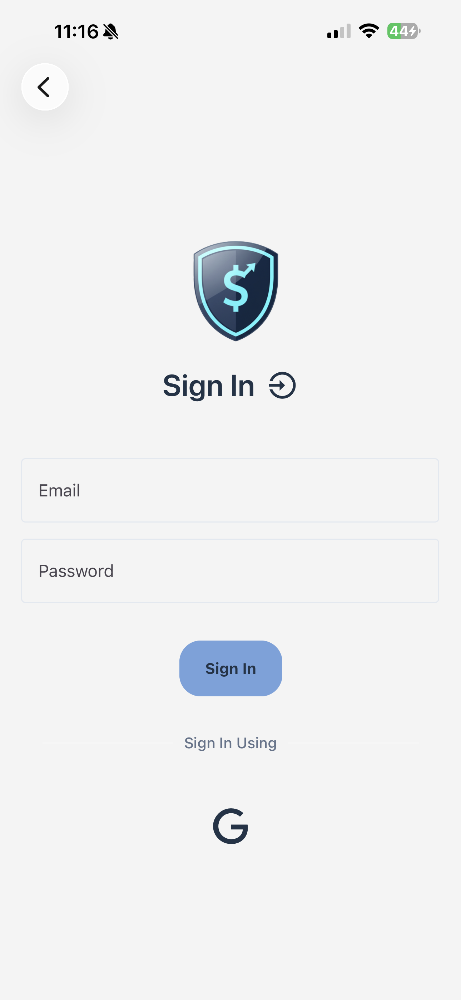

# 🛡️ GuardPay: Smart Shift & Salary Tracker

**GuardPay** is a mobile utility designed for security personnel and shift-based workers to effortlessly track work hours, calculate real-time earnings, and manage professional profiles with a modern interface.

## ✨ Key Features

### 📊 Monthly Analytics Dashboard

- [cite_start]**Real-Time Financial Health**: Get a bird's-eye view of your earnings with live tracking of "Monthly Pay" and "Total Hours" worked[cite: 1, 12, 13].
- [cite_start]**Executive Overview**: A high-level summary that simplifies complex payroll data into a clean, intuitive interface[cite: 7, 8].
- [cite_start]**Smart Salary Breakdown**: Visualize the clear relationship between Gross income, total deductions, and your final Net (Neto) pay[cite: 12, 13].
- [cite_start]**Detailed Overtime Tracking**: Automatically categorizes work hours into specific legal pay brackets, including 125%, 150%, and specialized weekend rates of 175% and 200%[cite: 2].

### 📅 Precision Shift Logging

- **Smart Presets**: One-tap shift entry using "Morning", "Evening", and "Night" presets for faster logging.
- [cite_start]**Automated Calculations**: Instant duration and pay calculation based on your specific start and end times[cite: 2].
- [cite_start]**Shift History**: Access a detailed historical overview of all past sessions with individual pay breakdowns[cite: 1, 2].

### 📄 Professional Paycheck Generation

- [cite_start]**One-Click PDF Statement**: Instantly convert your monthly overview into a formal, structured pay slip with a single tap[cite: 1, 2].
- [cite_start]**Tax & Deduction Transparency**: Clear itemization of mandatory deductions, including Income Tax (Mas Hachnasa), Social Security (Bituah Leumi), and Pension contributions[cite: 4, 5, 6, 10, 11].
- **Native Sharing**: Seamlessly export and share your PDF statements via WhatsApp, Email, or save directly to cloud storage.

### 👤 Dynamic Profile Management

- [cite_start]**Custom Compensation**: Set your unique base hourly rates and travel/ride compensation for precise earnings[cite: 2].
- [cite_start]**Profile Automation**: Automatic age calculation from birthdate and personalized user settings[cite: 1].
- **Secure Data Persistence**: Seamless integration with Appwrite to ensure your financial data remains secure and accessible.

---

## 🚀 Tech Stack

- **Framework**: [React Native](https://reactnative.dev/) with [Expo](https://expo.dev/)
- **Navigation**: [Expo Router](https://docs.expo.dev/router/introduction/) (File-based routing)
- **Backend**: [Appwrite](https://appwrite.io/) (Authentication & NoSQL Database)
- **UI Components**: [React Native Paper](https://reactnativepaper.com/)

---

The cleanest and most reliable way to display images on GitHub is using Relative Paths. This method is preferred because it works automatically across different branches and even if you rename your repository, as it doesn't rely on a hardcoded URL.

🖼️ The Cleanest Gallery Snippet
Replace your gallery section with this code. It uses HTML for better control over alignment and sizing:

Markdown

## 📸 Screen Gallery Dark Mode

<p align="center">
  
  
  
  
  
  
  
  
</p>

<p align="center">
  <em>Add shift &bull; Edit profile &bull; Month overview &bull; Profile &bull; Shifts Dashbord &bull; Law pdf &bull; Language select &bull; set reminder</em>
</p>

## 📸 Screen Gallery Light Mode

<p align="center">
  
  
  
  
  
  
  
  
</p>

<p align="center">
  <em>Add shift &bull; Edit profile &bull; Month overview &bull; Profile &bull; Shifts Dashbord &bull; Law pdf &bull; Language select &bull; set reminder</em>
</p>

## Register & Sign-in & Paycheck

<p align="center">
  
  
  
  
</p>

<p align="center">
  <em>Landing Page &bull; Paycheck Generator &bull; Register Page &bull; Sign-in Page </em>
</p>

## 🛠️ Installation & Setup

1.  **Clone the repository**:

    ```bash
    git clone [https://github.com/ItzhakRouach/guardPay.git](https://github.com/ItzhakRouach/guardPay.git)
    cd guardPay
    ```

2.  **Install dependencies**:

    ```bash
    npm install
    ```

3.  **Environment Variables**:
    Create a `.env` file in the root directory and add your Appwrite credentials:

    ```env
    EXPO_PUBLIC_APPWRITE_ENDPOINT=[https://cloud.appwrite.io/v1](https://cloud.appwrite.io/v1)
    EXPO_PUBLIC_APPWRITE_PROJECT_ID=your_project_id
    EXPO_PUBLIC_APPWRITE_DB=your_database_id
    EXPO_PUBLIC_APPWRITE_USERS_PREFS_ID=your_collection_id
    ```

4.  **Launch the app**:
    ```bash
    npx expo start
    ```

---

## 🛣️ Roadmap

- [x] **Push Notifications**: Reminders to clock out of shifts.
- [x] **Export to PDF**: Generate professional monthly work reports for employers.
- [ ] **Bonus Tracking**: Add holiday pay rates.
- [x] **Improve Month Summary**: Improve the design and insight of month salaries.
- [ ] **Dynamic Shifts Type**:Enable user to set his shifts types time.
- [x] **Add multi-languege Support**: Add another languege support like Hebrew and Arabic.

---

### 🛡️ License & Copyright

**Copyright (c) 2026 Itzhak Rouach. All rights reserved.**

This project is proprietary. [cite_start]While you are welcome to explore the code for educational purposes, copying, distributing, or using the unique calculation logic for commercial or private gain is strictly prohibited without explicit written permission from the author[cite: 1].

---

**Created by [Itzhak Rouach](https://github.com/ItzhakRouach)**
